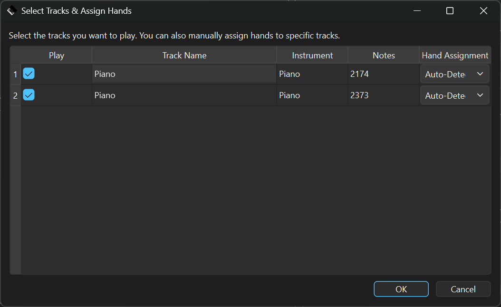
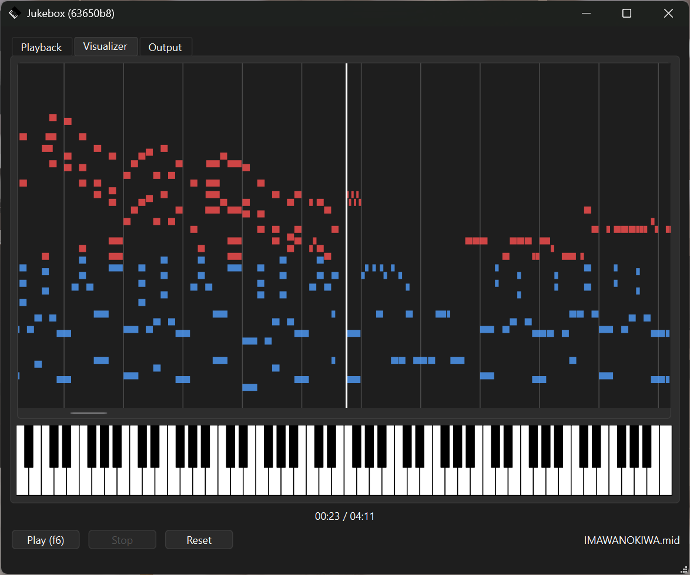

# Jukebox
Based on [MIDI2Key](https://github.com/smyGitt/Human-like-Roblox-Piano-Autoplayer-MIDI2Key/tree/01e55a2652752e727ea99dabcc01e50b83f6f97d) and [RobloxMidiConnect](https://github.com/LordHenryVonHenry/RobloxMidiConnect/tree/65add6ac227336af726fe2d442c172e5fd51f638) 

MIDI to Roblox Piano !  

Tested on Windows 11, but it should work on Linux and macOS.  

[Discord](https://discord.gg/jaxgETk5Em)
# Usage
```bash
# Install
git clone https://github.com/x15rte/Jukebox.git
cd Jukebox/
pip install -r ./requirements.txt

# Run
python ./main.py

# Update
git pull

---

# Open config dir
cd ~/.jukebox_piano/

# KEY Mode: 88-Key -> Ctrl, Pedal -> Space
```

# Screenshots






