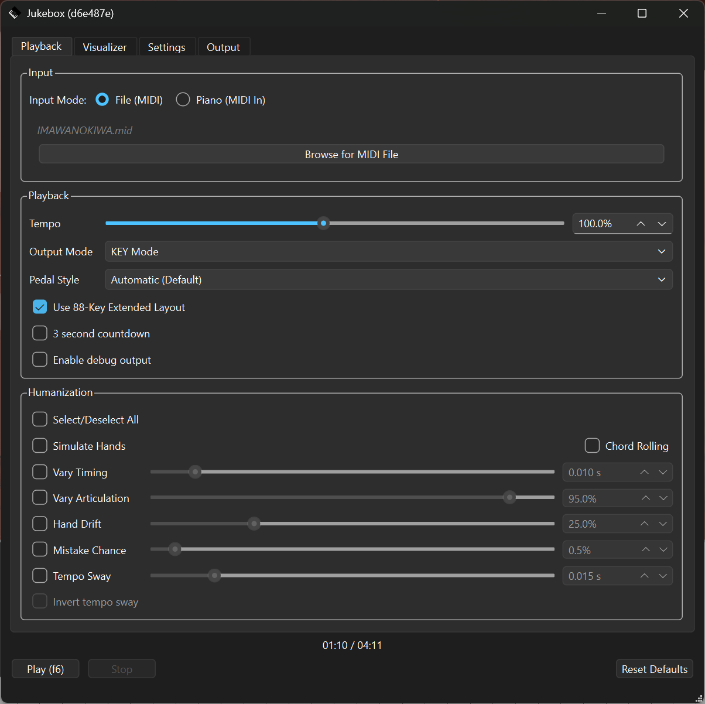
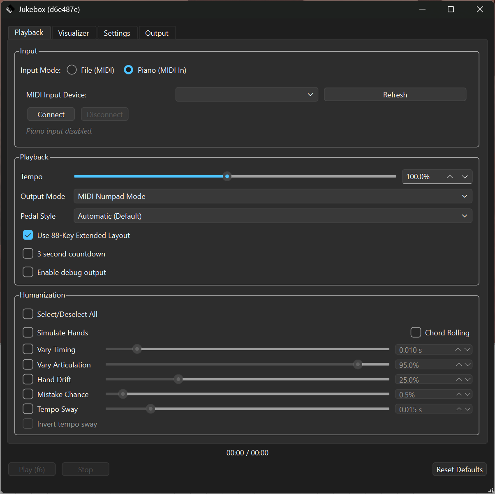
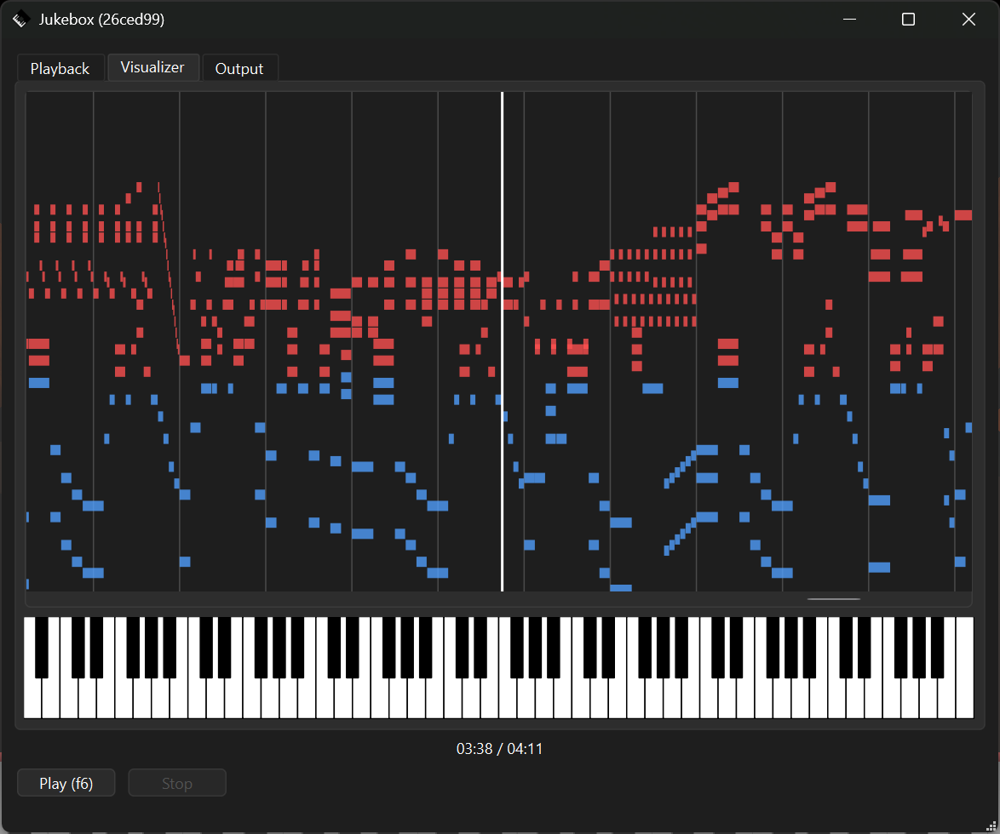
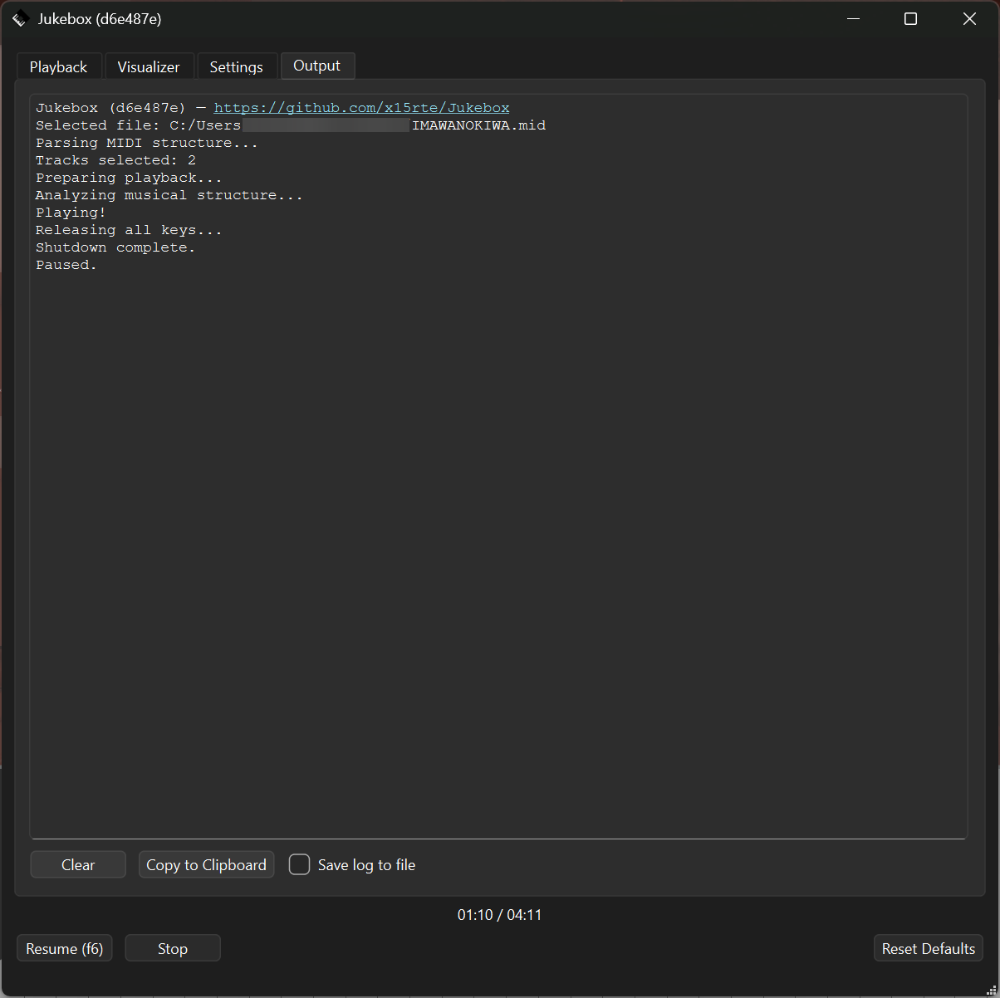

# Jukebox
Based on [MIDI2Key](https://github.com/smyGitt/Human-like-Roblox-Piano-Autoplayer-MIDI2Key/tree/01e55a2652752e727ea99dabcc01e50b83f6f97d) and [RobloxMidiConnect](https://github.com/LordHenryVonHenry/RobloxMidiConnect/tree/65add6ac227336af726fe2d442c172e5fd51f638) 

MIDI to Roblox Piano !  

Tested on Windows 11, but it should work on Linux and macOS.

# Usage
```bash
# Install
git clone https://github.com/x15rte/Jukebox.git
cd Jukebox/
python3 -m pip install -r ./requirements.txt

# Run
python3 ./main.py

# Update
git pull
```

# Screenshots







